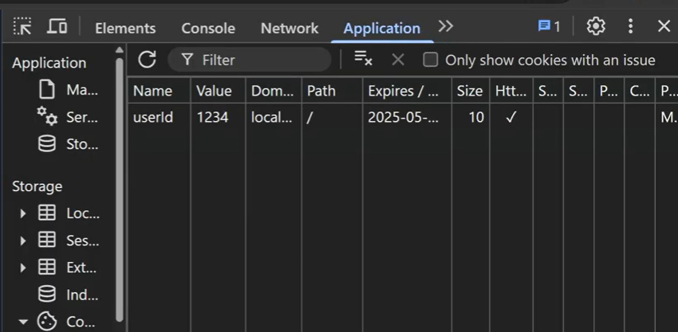

# Cookies

used for:

* login sessions
* authentication and authorization
* user tracking (remember a user across visits)


`cookies()` in nextjs is a server-side API and cannot be used on client components.


get


```javascript
import { cookies } from "next/headers";

export default async function Page(){

    const cookies = await cookies();
    
    const myname = cookies.get("name");

.....
}
```



delete


```javascript
import { cookies } from "next/headers";

export default async function Page(){

    const cookies = await cookies();
    
    cookies.delete("name");

.....
}
```



set


```javascript
import { cookies } from "next/headers";

export default async function Page(){

    const cookies = await cookies();
    
    cookies.set("name", "john", {
        maxAge: 60 * 60 * 24 * 7,
        httpOnly: true,
        secure: true,
        sameSite: "lax"
    })

.....
}
```


> maxAge: cookie lasts 7 days  (its value is in SECONDS)
> \
> httpOnly: JavaScript in the browser cannot access it
> \
> secure: only sent over HTTPS
> \
> sameSite: helps protect against CSRF (allow normal use, but be cautious when another website is involved)


check if a cookie exists or not


```javascript
import { cookies } from "next/headers";

export default async function Page(){

    const cookies = await cookies();
    
    if (cookies.has("name")){
        console.log("Cookie has been found");
    }

.....
}
```



### Where to see the Cookies ?

<figure><figcaption></figcaption></figure>

### SOURCES:

[https://nextjs.org/docs/app/api-reference/functions/cookies](https://nextjs.org/docs/app/api-reference/functions/cookies)



[https://www.youtube.com/watch?v=qTI7U4CAlVQ](https://www.youtube.com/watch?v=qTI7U4CAlVQ)


